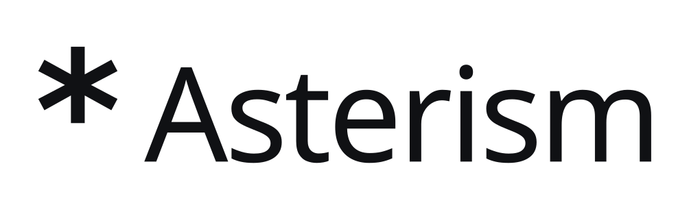

<p align="center">
  <picture>
    <source media="(prefers-color-scheme: dark)" srcset="assets/logo/asterism-wordmark-dark.svg">
    
  </picture>
</p>

<p align="center"><b>Run your AI agents 24/7 on hardware you already own.</b></p>

<p align="center">
  Everything your agent needs, made local.<br>
  Assemble compute, storage, GPUs, routes, and secrets from wherever they live.<br>
  Keep your agent running 24/7.
</p>

<p align="center">
  <a href="https://github.com/medicalissue/asterism/actions/workflows/ci.yml"></a>
  <a href="LICENSE-MIT"></a>
  <a href="https://asterism.run"></a>
</p>

<p align="center">
  
</p>

Asterism assembles compute, storage, GPUs, routes, and secrets from wherever
they live, then keeps your agent running 24/7. The `ast` CLI drives a local
`astd` daemon and boots isolated instances from cloud or OCI images.

A set of devices becomes an **orbit**: one computer whose CPU, memory, storage,
secrets, and network reach can come from different places. Asterism runs
persistent agents in real VMs, keeps each guest isolated behind its own kernel
and disk, and lets you operate every instance by name from any device in the
orbit.

No Asterism account or hosted control plane is required. Devices pair
directly, trust device keys, and communicate over an authenticated, encrypted
mesh.

## Install

```console
$ curl -fsSL https://asterism.run/install.sh | sh
```

The script chooses the available path for this machine. On macOS it installs
through Homebrew. On Linux it builds from source into `~/.local/bin`; that path
is experimental. The script prints every privileged command and waits for
confirmation. It does not install Homebrew or Rust.

```console
$ brew install --HEAD medicalissue/asterism/asterism
```

See the [platform-aware install guide](https://asterism.run/install) for the
current path and [packaging/README.md](packaging/README.md) for version pinning,
alternate prefixes, source refs, Homebrew, and update verification.

## Start an agent

```console
$ ast images
$ ast create agent --image debian:13 --cpus 4 --mem 8G --profile codex
$ ast up agent
$ ast ssh agent
$ ast status agent
```

`ast create` accepts catalog images, pinned cloud-image URLs, local qcow2 or
raw images, and OCI references such as `nginx` or
`ghcr.io/owner/app:v1`. Asterism creates a copy-on-write root disk, provisions
SSH keys with cloud-init, and applies optional bootstrap profiles for tools
such as git, tmux, Node, Claude Code, and Codex.

On macOS, Asterism uses Virtualization.framework when it satisfies the
instance's requirements and otherwise uses QEMU with Hypervisor.framework
acceleration. Pass `--backend vz` or `--backend qemu` to require one and get a
specific capability refusal when it cannot serve the instance.

Instances can restart after a guest crash or device reboot. Install `astd` as
the user service that keeps them running:

```console
$ ast service install
$ ast up agent --restart always
$ ast service status
```

Snapshots, backups, logs, and lifecycle commands use the same instance name:

```console
$ ast snapshot agent clean
$ ast snapshots agent
$ ast restore agent clean
$ ast backup export agent ~/Backups/agent
$ ast backup inspect ~/Backups/agent
$ ast logs agent --follow
$ ast down agent
```

## Add devices to an orbit

On the first device, create a single-use invitation:

```console
desktop$ ast device invite --name desktop
```

Paste its ticket on the other device:

```console
laptop$ ast device add <ticket> --name laptop
```

Both terminals show the same six-digit confirmation code before either device
is trusted. Pairing needs no coordinator. Once paired:

```console
$ ast devices
$ ast ping desktop
$ ast ls
```

Instance names form one orbit-wide namespace. `ast create` and `ast rename`
claim a name across the orbit, and ordinary commands such as `ast up agent`,
`ast ssh agent`, and `ast status agent` locate it and forward the request to
the device supplying its CPU. `ast ls` combines every device's registry shard
into one view and marks the state from an unreachable device as `unknown`.
The global `--device` option is for device-local administration and debugging,
not for reaching an instance.

## Assemble instances from parts

A device contributes parts. An orbit is the trusted pool of those devices. An
instance keeps the durable identity assembled from those parts, without a
special source device. CPU, root disk, and remote block volumes work today;
GPU and custom egress remain planned.

`ast status` shows where an instance's parts come from. Software inside the
guest sees ordinary local resources even when Asterism carries their
operations across the mesh.

- **CPU and memory** come from one device. Move them offline without changing
  the instance's name or identity; its root disk and snapshots transfer
  peer-to-peer as part of the move.

  ```console
  $ ast move agent desktop --down
  ```

- **Directory shares** expose a directory from the CPU device through 9p on
  QEMU or virtiofs on VZ.

  ```console
  $ ast attach agent --volume ~/work --at /workspace
  ```

- **Block volumes** can live on any device. They are leased to one instance
  at a time and appear in a QEMU guest as a normal disk such as `/dev/vdb`;
  the guest does not need to know which device holds the bytes.

  ```console
  $ ast --device storage volume create data --size 100G
  $ ast attach agent --volume storage:data
  ```

- **Secrets** keep their values in a source device's macOS login Keychain. The
  guest receives an opaque handle, and Asterism exchanges it for the value
  only on requests to the allowed authority. The value never enters the guest
  disk or a snapshot; platforms without a credential-store implementation
  refuse secret storage instead of writing a plaintext fallback.

  ```console
  $ printf '%s' "$ANTHROPIC_API_KEY" | ast secret create anthropic
  $ ast attach agent --secret anthropic --to api.anthropic.com
  ```

- **Network exit points** select the orbit device whose uplink and DNS
  resolver an instance uses. The default follows CPU placement. An explicit
  exit fails closed when its provider sleeps; fallbacks are used only when
  named, in order. Route exclusions always win, and orbit control traffic is
  never captured by a guest route.

  ```console
  $ ast attach agent --exit desktop --failover phone
  $ ast attach agent --exit desktop --route 0.0.0.0/0 \
      --exclude-route 10.0.0.0/8 --dns exit
  $ ast detach agent --exit
  ```

  The guest keeps one Asterism-owned virtual gateway and DNS address while an
  exit is attached, failed over, or detached, so no guest reconfiguration is
  needed. `ast status agent` shows the primary's locality, route/DNS policy,
  failover order, live selected path and RTT, degraded/failover health, and
  whether the policy has failed closed.

Remote block volumes currently require the QEMU backend. Directory shares
must be on the same device as the instance's CPU and memory.

## Reach guests and devices

`ast ssh <instance>` works from any orbit device. The local daemon resolves
the name and returns a loopback endpoint whether the guest is local or across
the mesh, so SSH itself does not need an exposed guest port or a device name.

A paired device can also offer its own user shell. This is disabled by
default and grants approved peers the full authority of that user account:

```console
desktop$ ast device shell enable
laptop$ ast ssh --host desktop
laptop$ ast ssh --host desktop -- uname -a
desktop$ ast device shell disable
```

Read [docs/device-shell.md](docs/device-shell.md) before enabling it; the
document covers approval scope, audit records, and revocation limits.

## Network and privacy

The default mesh uses n0's public iroh relays and `dns.iroh.link` discovery so
devices behind different NATs can find each other. Relays see ciphertext, but
the directory publishes a device's public key and current addresses. It does
not receive instance metadata.

If the devices already have routes to one another through a LAN, VPN, or
tailnet, keep discovery and relay traffic local:

```console
$ ASTERISM_MESH=local astd
```

This mode uses only peer addresses already on file. Custom relay and discovery
infrastructure can be selected with `ASTERISM_RELAY_URL`,
`ASTERISM_PKARR_RELAY`, and `ASTERISM_DNS_ORIGIN`.

## Updates

The CLI and menu-bar app use one signed update channel. An update verifies the
manifest and matching app, CLI, daemon, and helper before activation, and
rolls the unit back if activation fails. Homebrew installations remain owned
by Homebrew.

For a first desktop install on Apple silicon, download
`Asterism-<version>-darwin-arm64.dmg` from the matching GitHub release, open it,
and drag Asterism to Applications. The `.app.tar.gz` beside it is the updater
payload, not the manual installer.

```console
$ ast update status
$ ast update channel stable       # stable, beta, or nightly
$ ast update check
$ ast update apply --yes
```

## Roadmap

The next hardware part is a production remote GPU projection that presents
`/dev/nvidia0` inside a guest; the versioned boundary and current portable
proof are in [docs/remote-gpu-abi.md](docs/remote-gpu-abi.md).

## Build from source

```console
$ cargo build
$ cargo test
```

State lives in `~/.asterism`; set `ASTERISM_HOME` to override it. The Rust
workspace contains `asterism-core`, `asterism-daemon` (`astd`),
`asterism-cli` (`ast`), `asterism-mesh`, and `asterism-vz`.

Licensed under [MIT](LICENSE-MIT) or [Apache-2.0](LICENSE-APACHE), at your
option. Contributions are accepted under the same terms (DCO).
